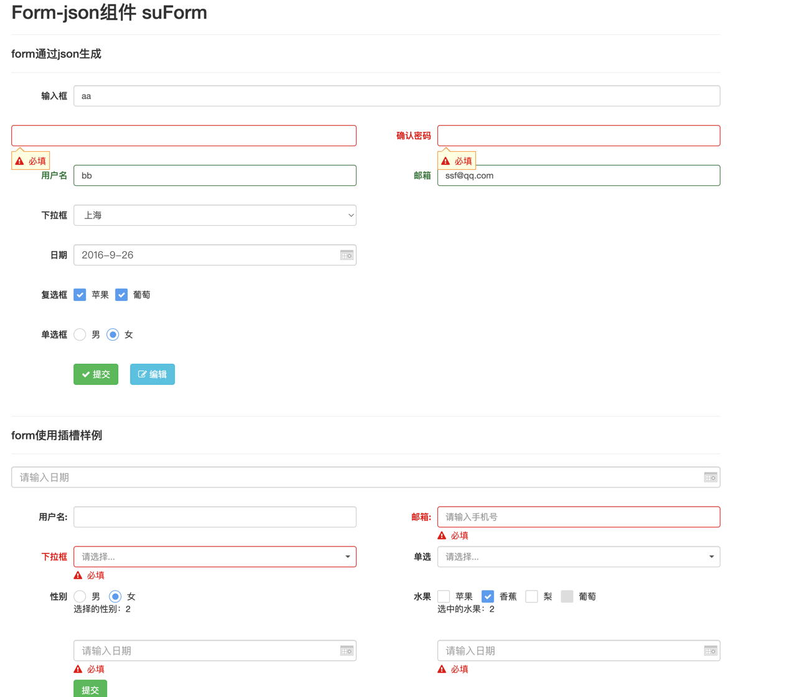

## 基本使用示例：

``` html
<su-form 
       v-ref:form1 
       offpos-style="true"
       id="fms1" 
       :data-option="dataOption" 
       :set-defaults="setDefaults" 
       :data-validator.sync="valid">
    <!--待验证组件，例子中是一个下拉框组件，必须在su-select标签中定义name属性 -->
    <mk-form-col :label='formFields.areaa.label' required_icon="true">
         <su-select :select-value.sync="queryParams.areaa" :high="120" :search="true" label-name="name" name="areaaMust" :data-source="areaaList" :multiple="false"></su-select>
    </mk-form-col>

</su-form>

```
``` javascript

  new Vue({
	 el: '#addDiv',
	 data:{
	    dataOption:{
	       rules: { //验证规则 
	      	  areaaMust :"required" //“areaaMust”为html标签中name属性的属性值
	       },
	       messages:{//提示语
	       	  areaaMust :"必填字段"
	       }
	    },
	    valid: false   //通过验证标志
	 },
	 methods: {
	    confirm:function(){
	         this.$refs.form1.valid();
	    	 if(this.valid==true){//表示验证通过
	    		//后续处理逻辑
	    		
	         }
	    }  
	 }
 }) 
```
## 属性：
  * `@submit.prevent` form提交事件 `Function`
  * `formdata.sync` 数据项绑定
  * `class` 自定义css样式

## 备注
- 待验证组件中必须添加name属性，属性值须在Vue对象的data中定义；
- 更多验证规则请参考：validationExtend.js文件的扩展规则；点击此处[validationExtend.md](./validationExtend.md)

## 示例图片
  

## 详细示例
  点击此处 [form表单使用](http://psd.jzdl.mgf.show/static/summer-vue-example/summer-vue/example/form-json.html "form表单使用教程")

